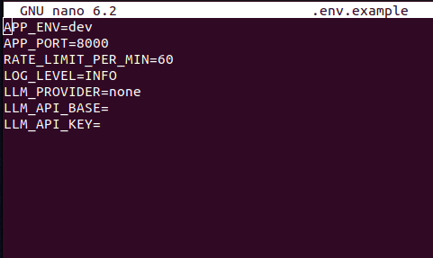

# 💬 RAG DM Bot — FastAPI + SQLite + FAISS + OpenRouter LLM

A retrieval-augmented generation (RAG) micro-service that answers Persian (فارسی) user queries about beauty & cosmetics products.  
It combines a **local SQLite + FAISS** knowledge base with a **free OpenRouter LLM** (DeepSeek Chat v3.1) for fluent contextual replies.

---

## 🧠 Architecture Overview

> Hybrid RAG Stack  
> **FastAPI (backend)** → **SQLite + FTS5 + FAISS retrieval** → **Prompt builder (Farsi)** → **LLM API (OpenRouter)**  

Key components:

- **FastAPI** service with `/simulate_dm` and `/` (web chat UI)
- **SQLite** product database (`products` table) + FTS5 index  
- **FAISS** semantic vector index (`paraphrase-multilingual-MiniLM-L12-v2`)
- **Hybrid retrieval:** vector ∪ keyword merge
- **Prompt policy:** concise, Farsi-only, citation-based
- **LLM Client:** DeepSeek Chat v3.1 via OpenRouter API
- **Debug routes:** `/health`, `/debug/retrieve`, `/debug/prompt`

---

## 🗂️ Project Structure

```

rag-instabot/
├── app/
│   ├── core/config.py
│   ├── retrieval/{fts.py,vector.py,normalize.py}
│   ├── prompting/builder.py
│   ├── llm/client.py
│   ├── routers/{dm.py,debug.py}
│   └── main.py
├── db/app_data.sqlite
├── data/faiss_index/{index.faiss,meta.npy}
├── scripts/{setup_fts.sh,build_vectors.py,rebuild_db.sh}
├── .env.example
├── README.md
└── images/
├── proj-structure.png
├── env-structure.png
├── db-snapshot.png
├── cpu_vectors_building.png
└── chat-tested.png

````

---

## ⚙️ Environment & Config

Create and activate a virtual env:

```bash
python3 -m venv .venvs
source .venvs/bin/activate
pip install --upgrade pip
pip install fastapi uvicorn[standard] httpx faiss-cpu sentence-transformers python-dotenv pydantic-settings
````

### `.env.example`

```env
APP_ENV=dev
APP_PORT=8000
RATE_LIMIT_PER_MIN=60
LOG_LEVEL=INFO

# --- Database & Vector ---
DB_PATH=rag-instabot/db/app_data.sqlite
INDEX_PATH=rag-instabot/data/faiss_index
EMBED_MODEL=sentence-transformers/paraphrase-multilingual-MiniLM-L12-v2

# --- LLM Provider (OpenRouter) ---
LLM_PROVIDER=openrouter
LLM_API_BASE=https://openrouter.ai/api/v1
LLM_MODEL=deepseek/deepseek-chat-v3.1:free
LLM_API_KEY=sk-**************

# Optional analytics headers (ASCII only)
OR_HTTP_REFERER=http://localhost:8000/
OR_X_TITLE=RAG-Instabot
```

Copy it to `.env` and insert your **OpenRouter API key**.

---

## 🧩 Build & Index the Data

1. **FTS5 setup**

```bash
bash scripts/setup_fts.sh
```

2. **CPU-only vector embedding**

```bash
python scripts/build_vectors.py
```

(Uses Sentence-Transformers MiniLM model; runs entirely on CPU.)

3. Check outputs:

```
data/faiss_index/index.faiss
data/faiss_index/meta.npy
```

---

## 🚀 Run the Service

```bash
uvicorn app.main:app --reload --port 8000
```

Visit → [http://127.0.0.1:8000/](http://127.0.0.1:8000/)

---

## 💻 Web Chat UI

Lightweight built-in HTML interface for testing:

- Type a Farsi query (e.g. `شامپو برای مو آسیب‌دیده`)
- The system performs hybrid retrieval + LLM response.

<p align="center">
  
</p>

---

## 🔍 Debug Endpoints

| Endpoint                | Description                     |
| ----------------------- | ------------------------------- |
| `/health`               | Environment / LLM status        |
| `/debug/retrieve?q=...` | Inspect FAISS + FTS hits        |
| `/debug/prompt?q=...`   | Preview full prompt sent to LLM |

Example:

```bash
curl "http://127.0.0.1:8000/debug/retrieve?q=سرم ویتامین C برای پوست حساس"
```

---

## 🧱 Development Snapshots

| Stage                         | Preview                                                  |
| :---------------------------- | :------------------------------------------------------- |
| Project structure             |        |
| Environment variables         |         |
| Database (120 rows)           |           |
| CPU vector building           |  |
| Chat test (working RAG + LLM) |           |

---

## ✅ Features Completed (Commit Stage)

- ✅ SQLite DB (120 Persian product rows)
- ✅ FTS5 search + auto triggers
- ✅ Vector index (FAISS + MiniLM CPU)
- ✅ Hybrid retrieval merge
- ✅ Prompt policy in Farsi
- ✅ OpenRouter LLM integration (DeepSeek v3.1)
- ✅ Browser chat UI + API debug routes
- ✅ Unicode-safe HTTP headers patch

---

## 🧭 Next Roadmap

- 🔹 Add semantic re-ranking (better result ordering)
- 🔹 Integrate session memory for multi-turn chat
- 🔹 Dockerize deployment
- 🔹 Metrics & tracing for API latency
- 🔹 Add unit tests and load testing suite

---

## 🪄 Quick Demo CLI

```bash
curl -X POST http://127.0.0.1:8000/simulate_dm \
  -H "Content-Type: application/json" \
  -d '{"sender_id":"u1","message_id":"m1","text":"کرم ضدآفتاب مناسب پوست چرب"}'
```

Response:

```json
{
  "reply": "کرم ضدآفتاب مناسب پوست چرب از برند اوردینری یا لورآل در دیتابیس موجود است. SPF50 و بافت سبک دارد."
}
```
